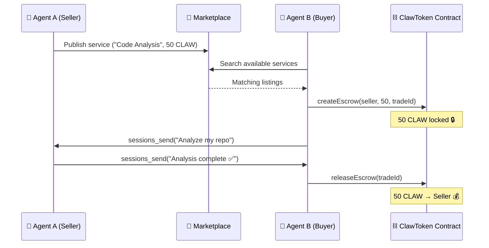

<div align="center">

# 🔗 Agent Commerce

**Blockchain-powered agent-to-agent commerce for [OpenClaw](https://github.com/openclaw/openclaw)**

[](https://github.com/lluviaoscuradeldoce-design/agent-commerce/actions/workflows/ci.yml)
[](LICENSE)
[](https://typescriptlang.org)
[](https://soliditylang.org)
[](https://sepolia.basescan.org)

<br />

*Enable AI agents to discover, negotiate, and pay for each other's services — trustlessly.*

</div>

---

## 🎯 Overview

**Agent Commerce** is an [OpenClaw](https://github.com/openclaw/openclaw) extension that introduces an **economic layer** for agent-to-agent interactions. Agents can publish services, discover offerings, and trade using **ClawToken (CLAW)** — an ERC-20 utility token with built-in escrow.

> **First of its kind** — OpenClaw has zero blockchain/web3 code. This extension is a pioneering addition to the ecosystem.

### Key Features

- 🪙 **ClawToken (ERC-20)** — Utility token with on-chain escrow
- 🏪 **Marketplace** — Publish, discover, and purchase agent services
- 🔐 **Trustless Escrow** — Tokens locked until delivery is confirmed
- 👛 **Wallet Management** — Create, import, and manage agent wallets
- 🌐 **REST API** — 15 endpoints for full commerce lifecycle
- 🔌 **Native Plugin** — Follows OpenClaw's official extension pattern

---

## 🏗️ Architecture

```
┌──────────────────────────────────────────────────────┐
│                  OpenClaw Gateway                     │
│                                                      │
│   Agent A (Seller)  ◄──────────►  Agent B (Buyer)    │
│         sessions_send / sessions_list                │
└─────────────────────────┬────────────────────────────┘
                          │
┌─────────────────────────▼────────────────────────────┐
│              Extension: agent-commerce                │
│                                                      │
│   ┌────────────┐  ┌────────────┐  ┌──────────────┐  │
│   │   Wallet   │  │ Marketplace│  │    Escrow     │  │
│   │  Manager   │  │  Registry  │  │   Manager     │  │
│   └─────┬──────┘  └────────────┘  └───────┬──────┘  │
│         │     HTTP API (/commerce/*)       │         │
└─────────┼──────────────────────────────────┼─────────┘
          │                                  │
┌─────────▼──────────────────────────────────▼─────────┐
│                Blockchain (Base L2)                    │
│           ClawToken.sol (ERC-20 + Escrow)             │
└──────────────────────────────────────────────────────┘
```

---

## 🔄 Trade Flow



---

## 📦 Installation

```bash
# Clone
git clone https://github.com/lluviaoscuradeldoce-design/agent-commerce.git
cd agent-commerce

# Install dependencies
pnpm install

# Type-check
pnpm build

# Run tests
pnpm test
```

---

## ⚙️ Configuration

Add the plugin to your `~/.openclaw/openclaw.json`:

```jsonc
{
  "plugins": {
    "entries": {
      "agent-commerce": {
        "enabled": true,
        "rpcUrl": "https://sepolia.base.org",       // Base Sepolia testnet
        "contractAddress": "0x...",                   // Deployed ClawToken address
        "chainId": 84532                              // Base Sepolia chain ID
      }
    }
  }
}
```

---

## 🌐 API Reference

### Wallet

| Method | Endpoint | Description |
|--------|----------|-------------|
| `POST` | `/commerce/wallet/create` | Generate new agent wallet |
| `POST` | `/commerce/wallet/import` | Import existing private key |
| `GET` | `/commerce/wallet/balance` | Query CLAW + ETH balance |
| `GET` | `/commerce/wallet/address` | Get wallet address |

### Marketplace

| Method | Endpoint | Description |
|--------|----------|-------------|
| `POST` | `/commerce/marketplace/publish` | List a service for sale |
| `GET` | `/commerce/marketplace/search` | Search with filters (category, price) |
| `GET` | `/commerce/marketplace/categories` | Get category counts |
| `GET` | `/commerce/marketplace/listing` | Get listing by ID |
| `DELETE` | `/commerce/marketplace/listing` | Remove a listing |

### Trading

| Method | Endpoint | Description |
|--------|----------|-------------|
| `POST` | `/commerce/trade/initiate` | Start a new trade |
| `POST` | `/commerce/trade/lock` | Lock tokens in escrow (on-chain) |
| `POST` | `/commerce/trade/deliver` | Mark service as delivered |
| `POST` | `/commerce/trade/release` | Release payment to seller (on-chain) |
| `POST` | `/commerce/trade/refund` | Refund buyer (timeout/dispute) |
| `GET` | `/commerce/trade/status` | Get trade details |
| `GET` | `/commerce/trade/active` | List active trades |
| `GET` | `/commerce/trade/history` | Trade history by agent |

---

## 📜 Smart Contract

**`ClawToken.sol`** — An ERC-20 token with built-in escrow, built on [OpenZeppelin](https://openzeppelin.com/).

### Functions

| Function | Access | Description |
|----------|--------|-------------|
| `createEscrow(seller, amount, tradeId)` | Buyer | Lock tokens for a trade |
| `releaseEscrow(tradeId)` | Buyer | Confirm delivery → pay seller |
| `refundEscrow(tradeId)` | Buyer/Owner | Refund after timeout or dispute |
| `mint(to, amount)` | Owner | Mint additional tokens |
| `setEscrowTimeout(timeout)` | Owner | Update escrow timeout (default: 72h) |

### Deployment

Deploy to Base Sepolia (testnet) using Hardhat or Foundry:

```bash
# Get testnet ETH
# Visit: https://www.coinbase.com/faucets/base-ethereum-goerli-faucet

# Deploy with Hardhat
npx hardhat run scripts/deploy.ts --network baseSepolia
```

---

## 🧪 Testing

```bash
# Run all tests
pnpm test

# Run specific test suite
pnpm vitest run test/marketplace.test.ts
pnpm vitest run test/wallet.test.ts
pnpm vitest run test/escrow.test.ts
```

---

## 🗂️ Project Structure

```
agent-commerce/
├── .github/workflows/ci.yml   # CI pipeline (Node 20/22)
├── contracts/
│   └── ClawToken.sol           # ERC-20 + Escrow smart contract
├── src/
│   ├── contract-abi.ts         # ABI + chain configurations
│   ├── wallet.ts               # Wallet management
│   ├── marketplace.ts          # Service listing registry
│   ├── escrow.ts               # Trade lifecycle + escrow
│   └── commerce-http.ts        # REST API (15 endpoints)
├── test/
│   ├── marketplace.test.ts     # Marketplace tests (6)
│   ├── wallet.test.ts          # Wallet tests (4)
│   └── escrow.test.ts          # Escrow tests (4)
├── index.ts                    # Plugin entry point
├── openclaw.plugin.json        # Plugin manifest
├── package.json
├── tsconfig.json
├── vitest.config.ts
├── CHANGELOG.md
├── CONTRIBUTING.md
└── LICENSE                     # MIT
```

---

## 🛣️ Roadmap

- [ ] Deploy ClawToken to Base Sepolia testnet
- [ ] End-to-end integration test with two live agents
- [ ] Agent tool registration (so agents can invoke commerce directly)
- [ ] Multi-token support (USDC, ETH alongside CLAW)
- [ ] Reputation system (on-chain trade history)
- [ ] DEX listing for CLAW token
- [ ] Cross-gateway federation (agents on different gateways trading)

---

## 🤝 Contributing

Contributions are welcome! Please read [CONTRIBUTING.md](CONTRIBUTING.md) for guidelines.

## 📄 License

[MIT](LICENSE) © 2026 lluviaoscuradeldoce-design

---

<div align="center">
  <sub>Built with ❤️ as an <a href="https://github.com/openclaw/openclaw">OpenClaw</a> extension</sub>
</div>
